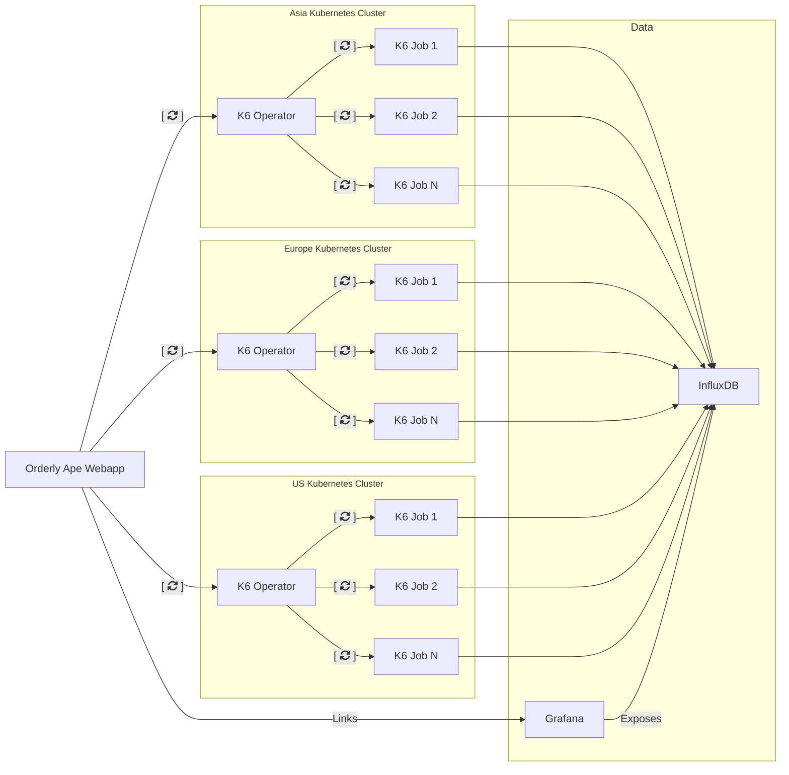

[](https://discord.gg/TTneqF8XRw)


# Orderly Ape

Orchestrate and run k6 load tests across multiple Kubernetes clusters. It consists of two main components:

1. A web application with a traditional API that allows configuring tests and coordinating between independent k6-operators in Kubernetes clusters.
2. A k6 operator that consumes the API, executes the load tests, and reports the state back to the web application. This allows the test runs to be coordinated by the webapp and exposed to the user.

## Table of Contents

- [Sponsors](#sponsors)
- [Architecture](#architecture)
- [Installation on Digital Ocean](#installation-on-digital-ocean)
  - [Prerequisites](#prerequisites)
  - [Setup Steps](#setup-steps)
  - [Troubleshooting](#troubleshooting)
- [Using Orderly Ape](#using-orderly-ape)
  - [Dashboard](#dashboard)
  - [Creating a Test (Add Test Run)](#creating-a-test-add-test-run)
- [Installing Additional Testing Locations](#installing-additional-testing-locations)
- [k6-operator State Diagram](#k6-operator-state-diagram)
- [License](#license)

## Sponsors

### Silver Sponsors

<p align="center">
  
  
  
</p>

Orderly Ape is actively [looking for more sponsors](https://forms.gle/fbYeFHYxS6eaxKwQ6) or contribute directly via [GitHub Sponsors](https://github.com/sponsors/ReviewSignal).

This project is supported by Open Source credits from [Digital Ocean](https://www.digitalocean.com/?refcode=f7ab9b6a5532)

## Architecture

- [webapp](webapp) - Web application that allows configuring tests and coordinating between independent k6-operators in Kubernetes clusters.
- [k6-operator](k6-operator) - k6 operator that consumes the API, executes the load tests, and reports the state back to the web application.
- [k6](k6) - k6 container image that can be used to run k6 tests in a Kubernetes cluster.



## Installation on Digital Ocean

> **🎥 Quick Start**: Watch our [How to Install Orderly Ape](https://www.youtube.com/watch?v=clFJppj6YYU) video on YouTube for a visual walkthrough.


> **⚠️ Important**: This installation guide is specifically for Digital Ocean. For other cloud providers, you'll need to adapt the commands and configuration accordingly.

### Prerequisites

> **📋 Note**: Make sure you have administrative access to a Kubernetes cluster and the necessary permissions to create namespaces and deploy applications.

Install the following tools:
- `kubectl` - Kubernetes command-line tool
- `helm` - Kubernetes package manager  
- `helmfile` - Declarative spec for deploying helm charts
- `doctl` - Digital Ocean command-line tool

### Setup Steps

1. **Install dependencies using Homebrew:**

    ```bash
    brew install kubectl helm helmfile doctl
    ```

    > **💡 Tip**: For non-macOS systems, install these tools using your system's package manager or download directly from their official websites.

2. **Initialize helmfile:**

    ```bash
    helmfile init
    ```

3. **Create Kubernetes Cluster**

    - Recommended: Use dedicated nodes for tests
    - Configure auto-scaling (recommended: min 3 nodes)

    > **⚠️ Warning**: Make sure you check the Kubernetes version at the top to know what version Orderly Ape has been tested up to. Installing newer versions may not work.

4. **Connect to DigitalOcean Cluster**

    ```bash
    doctl kubernetes cluster kubeconfig save <cluster-name>
    ```

    - Use personal access token for authentication

5. **Copy and Configure `values.yaml`**

    Download the configuration template from [/deploy/all-in-one/values.yaml](/deploy/all-in-one/values.yaml)

    - Fill out all required configuration parameters
    - Set admin credentials


6. **Deploy the application**

    ```bash
    curl -s https://raw.githubusercontent.com/ReviewSignal/orderly-ape/refs/tags/v0.1.2/deploy/all-in-one/helmfile.yaml | helmfile sync -f-
    ```

    - This pulls the helmfile and automatically deploys the application
    > **📌 Version Note**: Replace `v0.1.2` with the latest version from the [releases page](https://github.com/ReviewSignal/orderly-ape/releases).

7. **Retrieve Service IP**

    ```bash
    kubectl -n orderly-ape get service
    ```

    - Locate the service with an external IP

8. **DNS Configuration**

    - Map your domain to the external IP from the previous step
    - Ensure it matches the domain in `values.yaml`


9. **Verify SSL certificates**

    ```bash
    kubectl -n orderly-ape get certificates
    ```


    Ensure the Ready state is `True` for all certificates.

10. **Access Application**
    - Open `https://<your-domain>/admin/`
    - Login with admin credentials set in `values.yaml`
    - Run your k6 load tests

### Troubleshooting

- **Prerequisites**: Verify all tools are installed and accessible in your PATH
- **Connectivity**: Check kubernetes cluster connectivity with `kubectl cluster-info`
- **Deployment**: Ensure helmfile sync completes without errors
- **Certificates**: If you get invalid certificate warnings, wait a few minutes for automatic certificate issuance

    ```bash
    # Monitor certificate status
    watch kubectl -n orderly-ape get certificates
    ```

    > **📚 Additional Help**: Refer to [Cert Manager documentation](https://cert-manager.io/docs/troubleshooting/) for certificate issues.

## Using Orderly Ape

> **🎥 Quick Start**: Watch our [How to Use Orderly Ape](https://www.youtube.com/watch?v=qnm8Doz4piM) video on YouTube for a visual walkthrough.

Once your Orderly Ape instance is installed, it is accessible at `https://<your.hostname>/admin/`

The hostname and your login credentials were set at install in your `values.yaml` file in the orderlyape section:

```yaml
orderlyape:
  host: orderlyape.example.com
  adminPassword: yourpassword
```

### Dashboard


#### Groups (Advanced Users)

Groups are used to manage workers. You likely don't need to edit or change anything here unless you really know what you are doing.

#### Users

Users are necessary to create accounts for other users to login to the admin system and to allow additional testing locations to connect to Orderly Ape.

#### Test Locations

This manages all the testing locations that can be used when running a test. See the [Installing Additional Testing Locations Documentation](#installing-additional-testing-locations).

#### Test Outputs (Advanced Users)

This is for advanced users only. It defines where testing data is sent. By default it's sent to influxdb which is installed when you setup Orderly Ape.

#### Test Runs

Running k6 tests happens here.


You have a dashboard with all your tests, their results, status, date and other details. Tests can be started, cancelled and deleted from the dashboard using the `Action` menu.

#### Creating a Test (Add Test Run)


##### Target

This is the URL the test will execute on.

##### Test Output

Do not change this unless you know what you're doing. This sends the data to influxdb.

##### Source Repo

Currently, Orderly Ape loads tests from GitHub (public repositories only). You put the repository address where the script you want to run is hosted. The file is selected later in [Test Script File](#test-script-file)

> **📝 Note**: Only public GitHub repositories are currently supported. Other options such as private repository support may be added in future versions.

##### Git Reference

Orderly Ape allows you to select which branch, tag or commit hash you would like the script to load from in the repo.

##### Test Script File

The test file you want to run in the repo.

##### Per-worker CPU

How many CPUs will be allocated per worker.

##### Per-worker Memory

How much memory to allocate to each worker.

##### Node Selector (Advanced Users Only)

Leave empty unless you know what you're doing. This can help you select which kubernetes node it will execute on.

##### Job Deadline

How long the test is expected to run (add a little additional time for initializing the cluster and test nodes). This makes sure tests don't run indefinitely.

This uses the [golang duration format](https://pkg.go.dev/time#Duration) (e.g., `1h` or `1h30m` or `1h45m30s`).

##### Test Run Locations

This controls where the test will run. The default location is `local` which is on the main kubernetes cluster where the webapp, Grafana and InfluxDB are running. You can [add additional test locations](#installing-additional-testing-locations) to scale up tests to multiple regions. You can control how many workers will run in each region, set the region to 0 to not use a specific location.

##### Test Run ENV VARS

Test run Environmental Variables are variables passed to the k6 script upon execution. It is equivalent to `-e VAR_NAME=VAR_VALUE` during k6 command line execution. Orderly Ape is designed to allow users to pass as many ENV VARS as needed, this can be useful because you might want to change test properties without changing the script.

The [k6 WordPress Benchmarks](https://github.com/ReviewSignal/k6-WordPress-benchmarks) scripts parameterize most of the variables to allow the same test to be run with different durations, number of users, website URL, sleep durations, etc.

##### Test Run Labels (Under Development)

Labels are intended to allow sorting/searching/grouping by different labels and values to help organize your test results.

## Installing Additional Testing Locations

> **🎥 Quick Start**: Watch our [How to Install  Additional Test Locations on Orderly Ape](https://www.youtube.com/watch?v=1JSedlK-NjA) video on YouTube for a visual walkthrough.

> **📍 Example Note**: In this example we use 'london' as the example location but please change it according to your setup and change all references to 'london'.

1. **Add location from Orderly Ape webapp**

2. **Add user from Orderly Ape webapp**

3. **Add user to Workers group**

4. **Create a `values.london.yaml` file in the `deploy/all-in-one/` folder:**

    ```yaml
    config:
        region: london
        api:
            endpoint: https://YourOrderlyApeWebApp.com/api
            user: london
            password: passwordgoeshere
    ```


5. **Create a new kubernetes cluster in the location of your choice.**

    - Make sure to turn on autoscaling and start at minimum 1 node (maximum is up to your scaling needs). The first node needs to be online to connect to the webapp cluster and start auto scaling to run tests.

6. **Connect to your kubernetes cluster** using the same command as step 4 of the main install:

    ```bash
    doctl kubernetes cluster kubeconfig save <clustername>
    ```

7. **Ensure you are in the proper context** on kubernetes (the one you just created). You can check your contexts using the following command:

    ```bash
    kubectl config get-contexts
    ```

    Find the context you wish to install in, copy the name and run the following:

    ```bash
    kubectl config use-context <your-namespace-context>
    ```

    > **⚠️ Context Warning**: Make sure you're in the correct context before proceeding. Installing in the wrong context could affect other clusters.

8. **Install the k6 operator:**

    ```bash
    kubectl create ns k6-london
    helm install -n k6-london -f values.london.yaml --wait k6-operator oci://ghcr.io/reviewsignal/orderly-ape/charts/k6-operator --version v0.1.2
    ```

    > **📌 Version Note**: Replace `v0.1.2` with the latest version from the releases page.

9. **Verify the installation** by checking the Test Locations (`/admin/loadtest/testlocation/`) in the Orderly Ape web app. You should see a green check next to the location you created. This indicates it created and connected successfully and can now be used for running tests.

### k6-operator state diagram

In a Kubernetes cluster, the k6-operator orchestrates test runs and reports back to the webapp. The following shows the states a test goes through.


## License

This project is licensed under the terms of the MIT license. See the [LICENSE](LICENSE) file for details.
