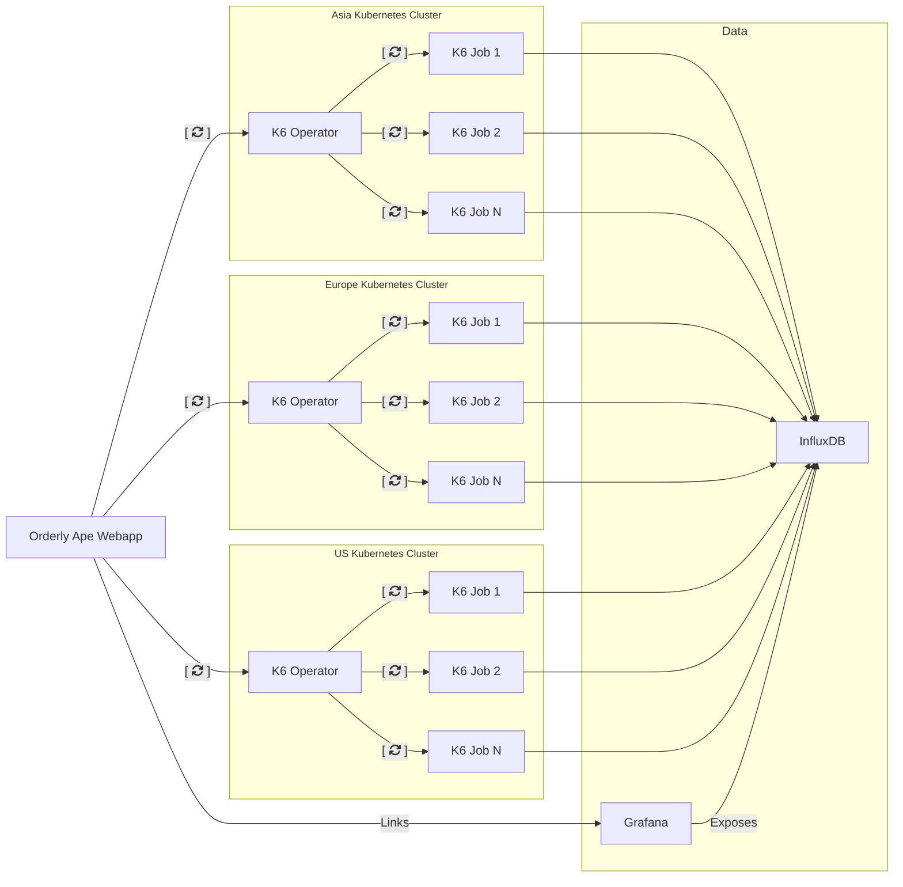
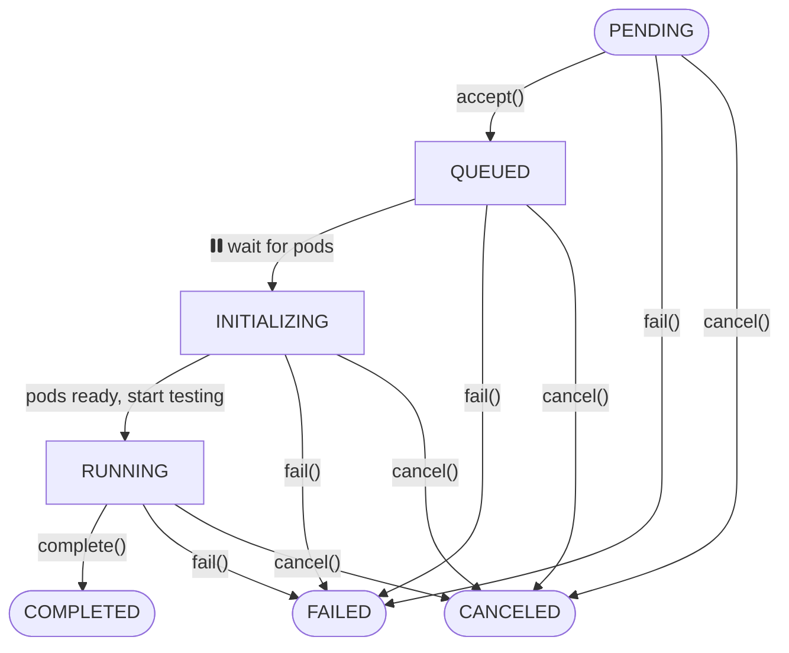

# Orderly Ape

Orchestrate and run k6 load tests across multiple Kubernetes clusters. It consists of two main components:

1. A web application with a traditional API that allows configuring tests and coordinating between independent k6-operators in Kubernetes clusters.
2. A k6 operator that consumes the API, executes the load tests, and reports the state back to the web application. This allows the test runs to be coordinated by the webapp and exposed to the user.

## Table of Contents

-   [Architecture](#architecture)
-   [Installation on Digital Ocean](#installation-on-digital-ocean)
-   [Additional Testing Locations](#installing-additional-testing-locations)
-   [K6 Operator State Diagram](#k6-operator-state-diagram)
-   [License](#license)

## Sponsors


### Silver Sponsors

<p align="center">
  
  
  
</p>

Orderly Ape is actively [looking for more sponsors](https://forms.gle/fbYeFHYxS6eaxKwQ6).


This project is supported by Open Source credits from [Digital Ocean](https://www.digitalocean.com/?refcode=f7ab9b6a5532)

## Architecture

-   [webapp](webapp) - Web application that allows configuring tests and coordinating between independent k6-operators in Kubernetes clusters.
-   [k6-operator](k6-operator) - k6 operator that consumes the API, executes the load tests, and reports the state back to the web application.
-   [k6](k6) - k6 container image that can be used to run k6 tests in a Kubernetes cluster.



## Installation on Digital Ocean

### Prerequisites

- Install the following tools:
  - kubectl
  - helm
  - helmfile
  - doctl

### Setup Steps

1. Install dependencies using Homebrew:
   ```bash
   brew install kubectl helm helmfile doctl
   ```

2. Initialize helmfile:
   ```bash
   helmfile init
   ```

3. Create Kubernetes Cluster
   - Recommended: Use dedicated nodes for tests
   - Configure auto-scaling (recommended: min 3)

4. Connect to DigitalOcean Cluster
   ```bash
   doctl kubernetes cluster kubeconfig save <cluster-name>
   ```
   - Use personal access token for authentication

5. Copy and Configure `values.yaml` which can be found in [/deploy/all-in-one/](/deploy/all-in-one/values.yaml)
   - Fill out all required configuration parameters
   - Set admin credentials

6. Deploy the application with the following command
   ```bash
   curl -s https://raw.githubusercontent.com/ReviewSignal/orderly-ape/refs/tags/v0.1.0/deploy/all-in-one/helmfile.yaml | helmfile sync -f-
   ```
   - This pulls the latest helmfile and automatically deploys the application

7. Retrieve Service IP
   ```bash
   kubectl -n orderly-ape get service
   ```
   - Locate the service with an external IP

8. DNS Configuration
    - Map your domain to the external IP from the previous step
    - Ensure it matches the domain in `values.yaml`

9. Make sure the SSL certificates have been successfully issued and Ready state is True
   ```bash
   kubectl -n orderly-ape get certificates
   ```

10. Access Application
    - Open `https://<your-domain>/admin/`
    - Login with admin credentials set in `values.yaml`
    - Run your k6 load tests

### Troubleshooting

- Verify all prerequisites are installed
- Check kubernetes cluster connectivity
- Ensure helmfile sync completes without errors
- If you're getting an invalid certificate warning, wait a few minutes for the certificate to get issued automatically (You can check using the command `watch kubectl -n orderly-ape get certificates`). Additionally, you can refer to [Cert Manager documentation](https://cert-manager.io/docs/troubleshooting/)

## Installing Additional Testing Locations

Please note: In this example we use 'london' as the example location but please change it according to your setup and change all references to 'london'.

1. Add location from Orderly Ape webapp

2. Add user from Orderly Ape webapp

3. Add user to Workers group

4. Create a values.london.yaml file in the deploy/all-in-one/ folder.

   ```yaml
   config:
     region: london
     api:
       endpoint: https://YourOrderlyApeWebApp.com/api
       user: london
       password: passwordgoeshere
   ```

5. Create a new kubernetes cluster in the location of your choice. Make sure to turn on autoscaling and start at minimum 1 node (maximum is up to your scaling needs). The first node needs to be online to connect to the webapp cluster and start auto scaling to run tests.

6. Connect to your kubernetes cluster using the same command as step 4 of the original install.

   ```bash
   doctl kubernetes cluster kubeconfig save <clustername>
   ```

7. Make sure you are in the proper context on kubernetes (the one you just created). You can check your contexts using the following command

   ```bash
   kubectl config get-contexts
   ```
   - Find the context you wish to install in, copy the name and run the following

   ```bash
   kubectl config set-context <your-namespace-context>
   ```

8. Run the following commands to create the namespace and install the Orderly Ape k6 operator
   ```bash
   kubectl create ns k6-london
   helm install -n k6-london -f values.london.yaml --wait k6-operator oci://ghcr.io/reviewsignal/orderly-ape/charts/k6-operator --version v0.1.0
   ```

9. Check the Test Locations (/admin/loadtest/testlocation/) in the Orderly Ape web app, you should see a green check next to the location you created. This indicates it created and connected successfully and can now be used for running tests.


### k6-operator state diagram

In a Kubernetes cluster, the k6-operator orchestrates test runs and reports back to the webapp. The following shows the states a test goes through.



## License

This project is licensed under the terms of the MIT license. See the [LICENSE](LICENSE) file for details.
