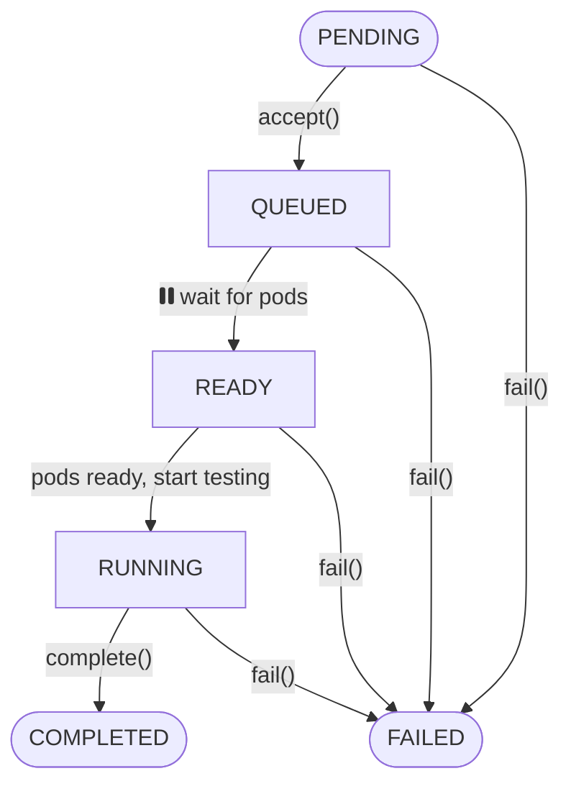

# Load Testing Tool

Orchestrate and run k6 load tests across multiple Kubernetes clusters. It consists of two main components:

1. A web application with a traditional API that allows configuring tests and coordinating between independent k6-operators in Kubernetes clusters.
2. A k6 operator that consumes the API, executes the load tests, and reports the state back to the web application. This allows the test runs to be coordinated by the webapp and exposed to the user.

## Table of Contents

-   [Installation](#installation)
-   [Usage](#usage)
-   [Flowchart](#flowchart)
-   [Contributing](#contributing)
-   [License](#license)

## Installation

_ToDo_

## Usage

_ToDo_

### k6-operator state diagram

In a Kubernetes cluster, the k6-operator orchestrates test runs and reports back to the webapp. The following shows the states a test goes through.

## License

This project is licensed under the terms of the MIT license. See the [LICENSE](LICENSE) file for details.
