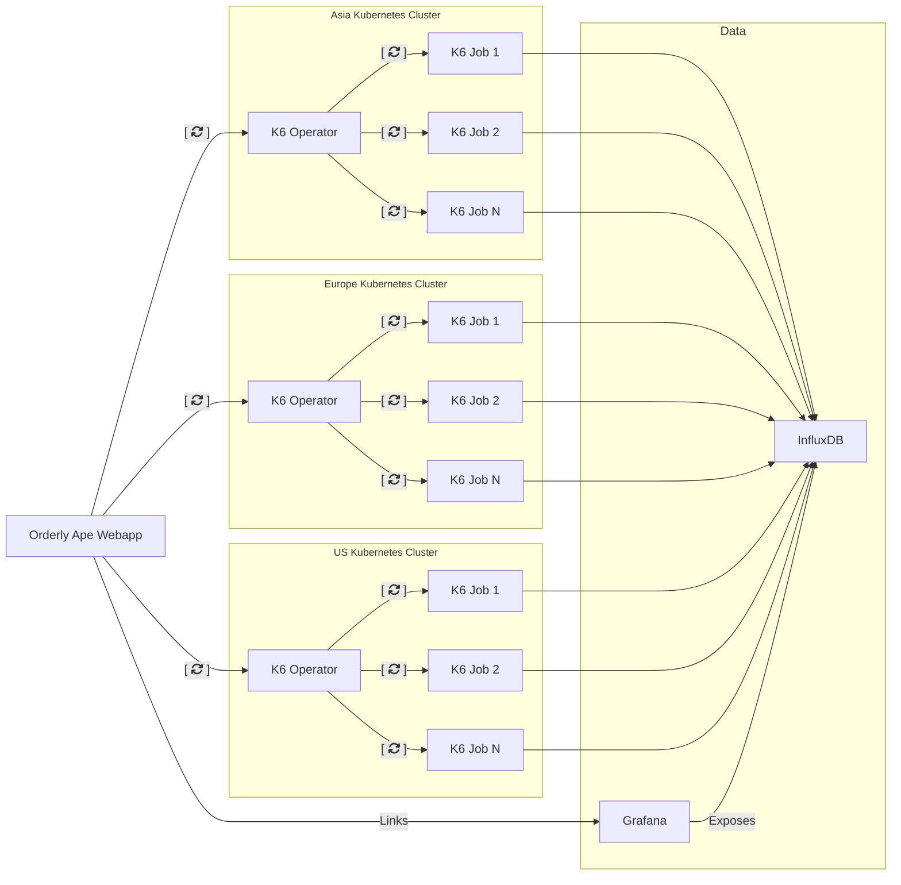
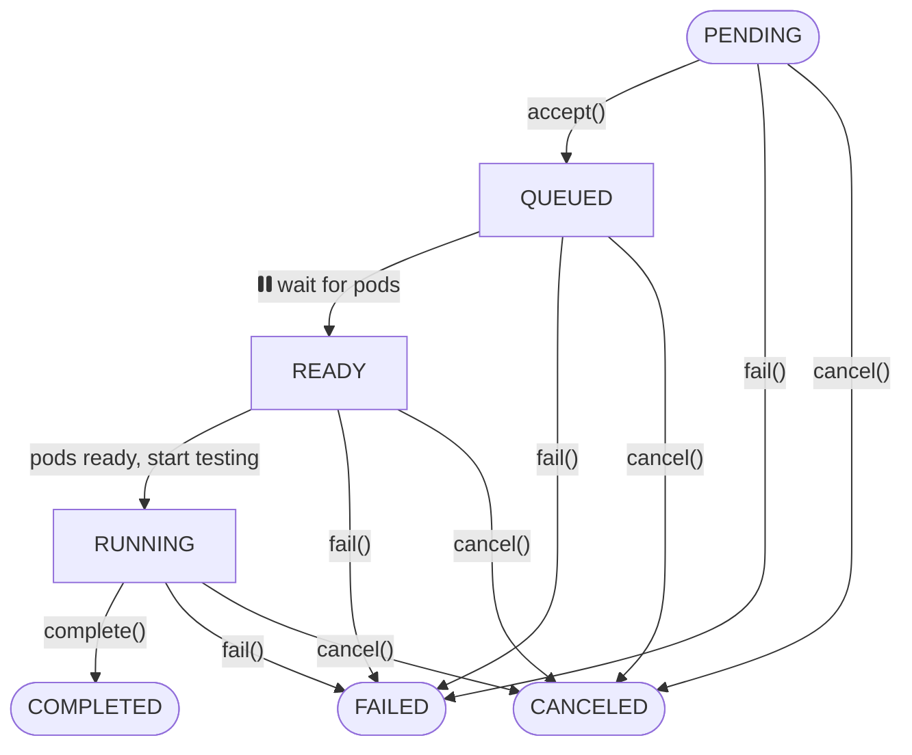

# Orderly Ape

Orchestrate and run k6 load tests across multiple Kubernetes clusters. It consists of two main components:

1. A web application with a traditional API that allows configuring tests and coordinating between independent k6-operators in Kubernetes clusters.
2. A k6 operator that consumes the API, executes the load tests, and reports the state back to the web application. This allows the test runs to be coordinated by the webapp and exposed to the user.

## Table of Contents

-   [Architecture](#architecture)
-   [Installation](#installation)
-   [K6 Operator Flowchart](#flowchart)
-   [Contributing](#contributing)
-   [License](#license)

## Architecture

-   [webapp](webapp) - Web application that allows configuring tests and coordinating between independent k6-operators in Kubernetes clusters.
-   [k6-operator](k6-operator) - k6 operator that consumes the API, executes the load tests, and reports the state back to the web application.
-   [k6](k6) - k6 container image that can be used to run k6 tests in a Kubernetes cluster.



## Installation on Digital Ocean

### Prerequisites

- Install the following tools:
  - kubectl
  - helm
  - helmfile
  - doctl

### Setup Steps

1. Install dependencies using Homebrew:
   ```bash
   brew install kubectl helm helmfile doctl
   ```

2. Initialize helmfile:
   ```bash
   helmfile init
   ```

3. Create Kubernetes Cluster
   - Recommended: Use dedicated nodes for tests
   - Configure auto-scaling if needed
   - Include managed database operator

4. Connect to DigitalOcean Cluster
   ```bash
   doctl kubernetes cluster kubeconfig save <cluster-name>
   ```
   - Use personal access token for authentication

5. Create Managed MySQL Database
   - Go to DigitalOcean Database section
   - Create a new MySQL database
   - Note the Database UUID (e.g., `2e0f0bf9-1804-474b-a101-107490c00183` in the URL)

6. Clone Repository
   ```bash
   git clone https://github.com/ReviewSignal/orderly-ape.git
   cd deploy/all-in-one
   ```

7. Configure `values.yaml`
   - Fill out all required configuration parameters
   - Include database connection details
   - Set admin credentials

8. Deploy Application
   ```bash
   helmfile sync
   ```

9. Retrieve Service IP
   ```bash
   kubectl -n orderly-ape get service
   ```
   - Locate the service with an external IP

10. DNS Configuration
    - Map your domain to the external IP from the previous step
    - Ensure it matches the domain in `values.yaml`

11. Access Application
    - Open `https://<your-domain>/admin/`
    - Login with admin credentials set in `values.yaml`

### Troubleshooting

- Verify all prerequisites are installed
- Check kubernetes cluster connectivity
- Validate database connection settings
- Ensure helmfile sync completes without errors


## Install Instructions (General)

### Pre-requisites

Before you install Orderly Ape you should install it's data stack, with a functional [Grafana](https://artifacthub.io/packages/helm/grafana/grafana)
instance that can connect and display data from a functional [InfluxDB](https://artifacthub.io/packages/helm/influxdata/influxdb2).

### Install the Orderly Ape

Orderly Ape publishes helm charts as OCI images in the GitHub Container Registry. You can check releases on the GitHub
repository [releases page](https://github.com/ReviewSignal/orderly-ape/releases).

#### Install the webapp

```bash
helm upgrade -i orderly-ape oci://ghcr.io/reviewsignal/orderly-ape/charts/orderly-ape v0.1.0
```

For more details, check the [webapp chart docs](deploy/charts/webapp/README.md).

#### Install the k6-operator

You should install the operator in all the Kubernetes clusters you want to run tests on. For compatibility with the
webapp, you shoud install the same version of the k6-operator as the webapp.

Also, for each operator, you should create a separate account on the webapp, and place the account in the `Workers`
group.

```bash
helm upgrade -i orderly-ape-k6-operator oci://ghcr.io/reviewsignal/orderly-ape/charts/k6-operator v0.1.0
```

For more details, check the [k6-operator chart docs](deploy/charts/k6-operator/README.md).

### k6-operator state diagram

In a Kubernetes cluster, the k6-operator orchestrates test runs and reports back to the webapp. The following shows the states a test goes through.



## License

This project is licensed under the terms of the MIT license. See the [LICENSE](LICENSE) file for details.
